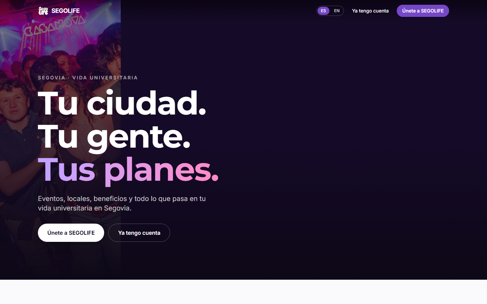
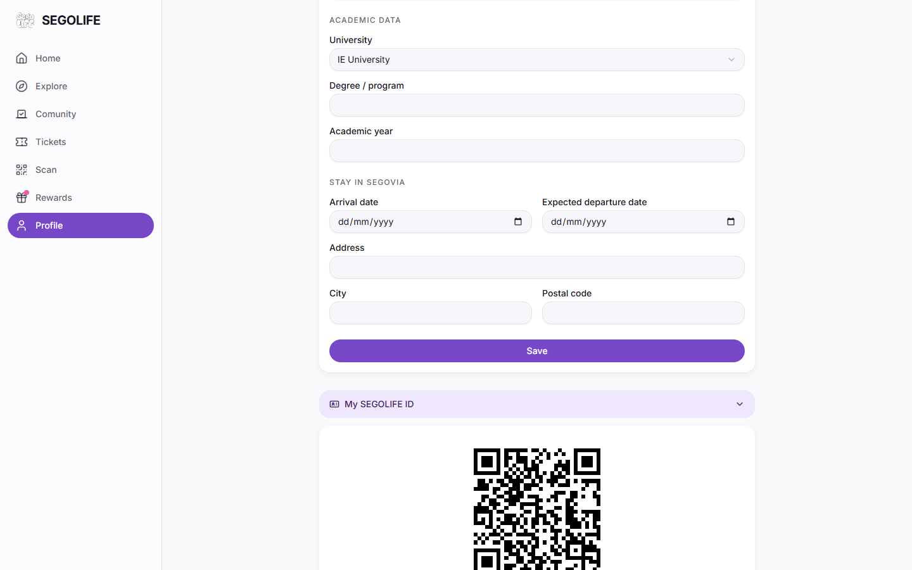

# SEGOLIFE — Manual General de Uso y Operación

> Documento verificado contra producción real (`www.segolife.es`) el
> 2026-08-17. Punto de entrada a los demás manuales de este directorio.

## ¿Qué es Segolife?

Segolife es la plataforma que conecta a los **estudiantes** de las
comunidades universitarias de Segovia (actualmente **IE University** y
**UVA**) con los **locales de ocio** de la ciudad (bares, discotecas,
restaurantes) y con la **vida social del campus** (eventos, sondeos,
propuestas de comunidad).

Un estudiante se registra una vez, elige su comunidad (IE o UVA), y desde
ahí puede: descubrir eventos, comprar entradas, acumular y gastar
**SegoTokens** en los locales adheridos, canjear **Beneficios**, e
identificarse en cualquier local mediante un **QR** personal.

## Roles de la plataforma

| Rol | Quién es | Dónde opera |
|---|---|---|
| **Student** | Estudiante de IE o UVA, usuario final de la app | App de Student (`/ie`, `/uva` y páginas internas tras login) |
| **Responsable de local** (`venue_admin`) | Encargado de un local adherido | Panel Mi Local (`/admin/mi-local`) — ver [01-responsable-local.md](01-responsable-local.md) |
| **Empleado** | Personal interno de Segolife dado de alta en RRHH | Portal del Empleado (`/empleado`) — ver [03-empleado.md](03-empleado.md) |
| **Administrador** | Equipo de Segolife | Panel de administración (`/admin`) — ver [02-administrador.md](02-administrador.md) |

Un mismo usuario puede tener como máximo un rol operativo — no hay cuentas
que combinen, por ejemplo, Student y Responsable de local a la vez.

## Duración de la sesión

La sesión permanece activa durante toda la jornada mientras haya actividad
normal en la plataforma — no hace falta volver a iniciar sesión solo por
dejar una pestaña abierta un rato o atender a un cliente entre una acción y
otra. Si una sesión deja de usarse durante un tiempo prolongado, o ha pasado
ya varios días desde el último inicio de sesión, la plataforma pedirá volver
a iniciar sesión mostrando el motivo ("Tu sesión ha caducado. Vuelve a
iniciar sesión para continuar.") y, tras identificarse de nuevo, se vuelve
automáticamente a la pantalla en la que se estaba trabajando.

## El ecosistema, superficie por superficie

- **Master (`segolife.es` / `www.segolife.es`)**: home pública, punto de
  entrada para quien todavía no ha elegido comunidad.
- **IE (`/ie`) y UVA (`/uva`)**: landing pública de cada comunidad —
  eventos, registro, acceso. El idioma por defecto de cada comunidad es
  distinto (IE en inglés, UVA en español); el estudiante puede cambiarlo
  luego desde su perfil.
- **App de Student**: tras iniciar sesión, el estudiante tiene Home,
  Explorar (eventos), Comunidad, Entradas, Escanear, Rewards
  (SegoTokens/Beneficios/Invitar) y Perfil.
- **Venue App (`/admin/mi-local`)**: panel operativo de cada
  Responsable de local — ver manual dedicado.
- **Portal del Empleado (`/empleado`)**: autoservicio de RRHH para el
  personal interno de Segolife.
- **Panel de Administración (`/admin`)**: Command Center y gestión completa
  de la plataforma para el equipo de Segolife.

## Conceptos clave

### SegoTokens (ST)

Moneda interna de fidelización de Segolife. Un Student gana SegoTokens por
determinadas acciones (definidas por reglas configurables) y puede
gastarlos en los locales adheridos que tengan activada la opción de canje.
Ningún gasto de SegoTokens se produce sin que el propio Student lo autorice
explícitamente desde su móvil — ni escanear un QR ni ninguna acción del
local, por sí sola, descuenta tokens. Detalle completo del flujo en
[01-responsable-local.md](01-responsable-local.md), sección 5.

### Beneficios (Benefits)

Recompensas que un Student puede adquirir canjeando SegoTokens acumulados
(por ejemplo, entrada libre en un local). Se gestionan desde la pestaña
**Rewards → My Benefits** de la app de Student.

### Eventos y entradas

Cada evento se configura con un modo de venta: algunos redirigen a una
plataforma externa de venta de entradas (Fourvenues), y en el futuro otros
podrán venderse de forma nativa dentro de Segolife. El Student siempre ve
claramente si va a comprar dentro de la app o si va a ser redirigido.

### Comunidad — sondeos y propuestas de Student

La pestaña **Comunidad** de la app de Student tiene dos caras. En **Activas/
Respondidas/Resultados** el Student vota sondeos publicados por el equipo de
Segolife (encuestas de sí/no, opción múltiple, ranking...). En **Proponer**,
cualquier Student puede lanzar su propia idea de plan (por ejemplo, "torneo
de pádel entre comunidades"):

- **Título** (obligatorio) y una breve descripción.
- **Imagen de portada** (opcional): se sube al momento desde el propio
  formulario — nunca hace falta pegar una URL a mano. Solo se aceptan
  fotografías reales (JPEG/PNG/WebP); cualquier otro tipo de archivo se
  rechaza con un aviso inmediato, antes de intentar subirlo.
- **Local relacionado** (opcional): un desplegable con los locales reales
  adheridos a la comunidad del Student.
- **Urgencia** (opcional): "Sin prisa" / "Pronto" / "Urgente" — es solo la
  preferencia personal del Student sobre cuándo le gustaría que ocurriera,
  nunca una prioridad interna del equipo de Segolife.
- **Cuándo te gustaría que fuera** (opcional): atajos rápidos ("Este finde",
  "La semana que viene") o una fecha concreta del calendario.

Al enviar, la idea queda **pendiente de revisión** — nunca se publica
directamente. El Student ve la confirmación al instante y el equipo de
Segolife recibe una alerta para moderarla desde el panel de administración.
Cuando el equipo decide (aprobarla o no), el Student recibe una
notificación con el resultado — si se rechaza, solo se muestra el motivo
que el equipo haya decidido compartir, nunca notas internas de moderación.
Una idea siempre pertenece a la comunidad real del Student que la propuso
(IE o UVA, según su cuenta) — el formulario nunca pregunta ni permite elegir
otra comunidad.

### QR de identidad (SEGOLIFE ID)

Cada Student tiene un QR personal permanente, visible en su perfil
("Mi SEGOLIFE ID"), que sirve para identificarse en cualquier local
(escaneado por el Responsable de local) o para acceder a un evento con
entrada nativa. Escanearlo identifica a la persona; no ejecuta ningún cobro
por sí mismo.

## Soporte e incidencias

- **Un Student** con problemas de acceso o de su cuenta: contacta con
  Segolife indicando su email de registro y comunidad (IE/UVA).
- **Un Responsable de local** con problemas operativos: ver la sección de
  preguntas frecuentes de [01-responsable-local.md](01-responsable-local.md).
- **Un Empleado** con problemas de acceso a su portal: contacta con RRHH de
  Segolife.

Para cualquier incidencia, es útil indicar siempre: quién eres (rol/email),
qué intentabas hacer, en qué pantalla, y a qué hora aproximada ocurrió.
