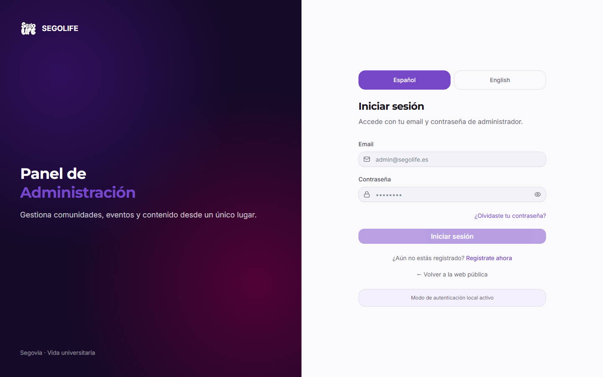
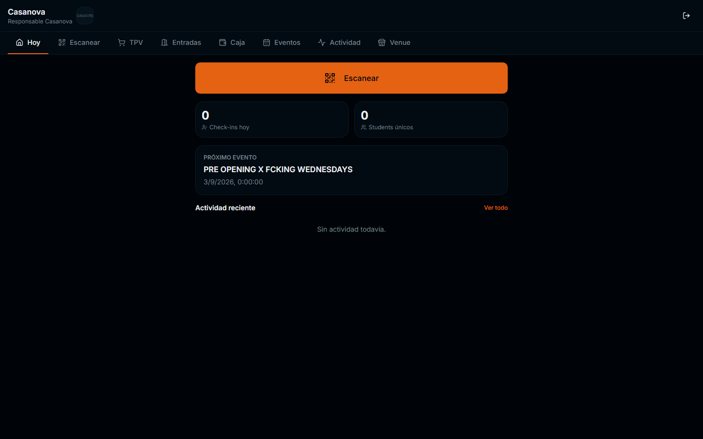
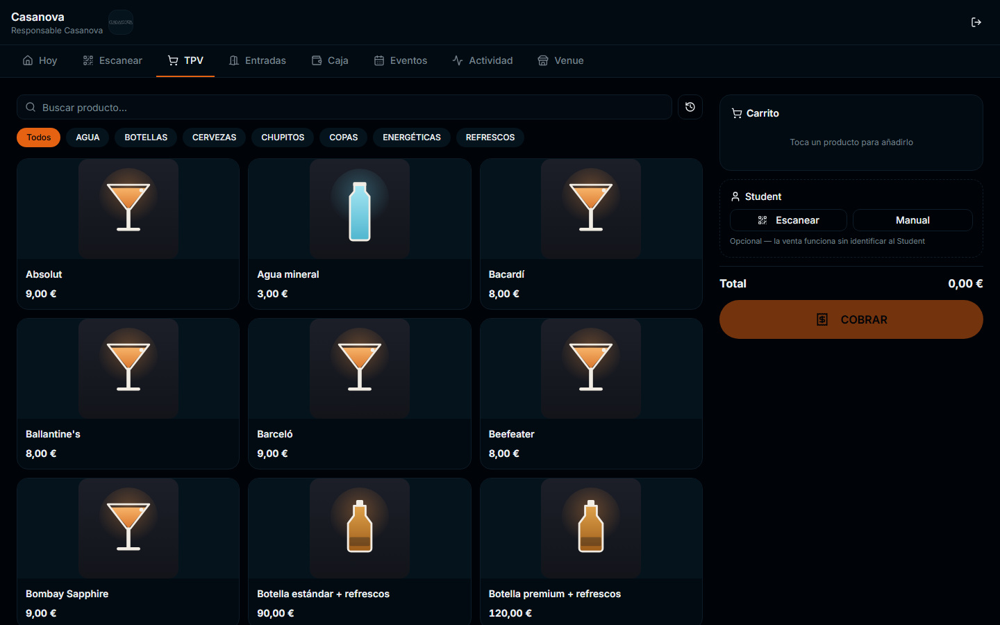
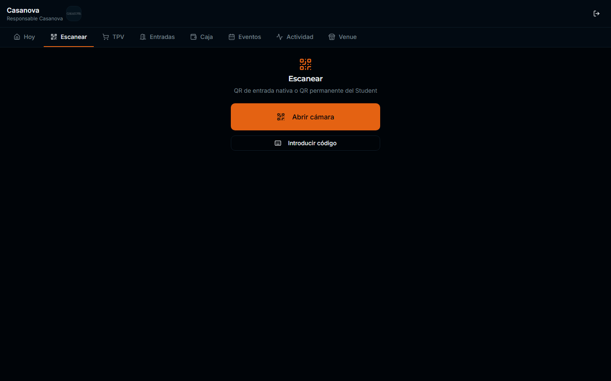
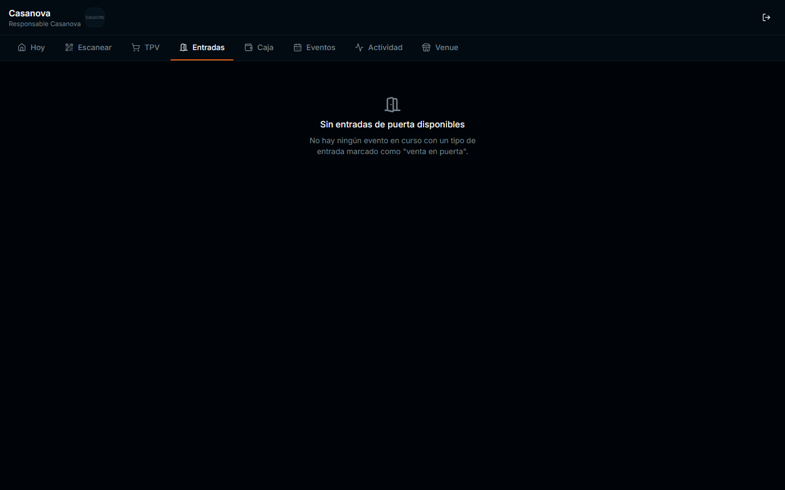
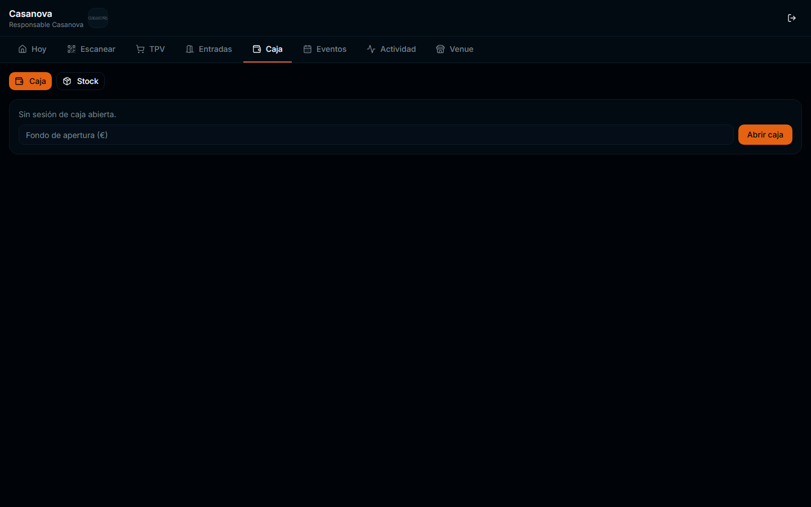

# SEGOLIFE — Manual del Responsable de Local

> Para quién es este manual: la persona que gestiona el día a día de un local
> adherido a Segolife (bar, discoteca, restaurante...) — rol de la
> plataforma: **Responsable de local** (nombre técnico interno: `venue_admin`).
>
> Documento verificado contra producción real (`www.segolife.es`) el
> 2026-08-17. Las capturas de este manual son de la cuenta real de
> **Casanova**; la interfaz es idéntica para los 7 locales activos, solo
> cambian el nombre y el catálogo de productos.

## 1. Acceder

1. Entra en **https://www.segolife.es/login**.
2. Introduce el email de tu local y la contraseña que se te ha entregado.
3. Tras entrar, la plataforma te lleva directamente a tu panel: **Mi Local**
   (`/admin/mi-local`). No verás el resto del panel de administración de
   Segolife — tu acceso está limitado a tu propio local por diseño y
   seguridad.

Si has olvidado tu contraseña o no puedes entrar, contacta con el equipo de
Segolife. No compartas tu contraseña con nadie fuera de tu equipo del local.

## 2. La barra de pestañas de Mi Local

Todo tu trabajo diario ocurre dentro de una única pantalla con pestañas.
No son páginas distintas — es normal que la web tarde un instante en
cambiar de contenido al pulsar una pestaña.

| Pestaña | Para qué sirve |
|---|---|
| **Hoy** | Resumen del día: check-ins, Students únicos, próximo evento, actividad reciente |
| **Escanear** | Escanear la entrada de un Student (QR nativo o QR permanente) |
| **TPV** | Vender productos (barra, tienda...) y cobrar |
| **Entradas** | Venta de entradas en puerta, si el evento en curso lo tiene activado |
| **Caja** | Abrir/cerrar caja, fondo de apertura |
| **Eventos** | Próximos eventos de tu local |
| **Actividad** | Historial de acciones de tu local |
| **Venue** | Datos de tu local |

## 3. TPV — vender y cobrar

1. Pulsa la pestaña **TPV**.
2. Busca el producto por nombre o filtra por categoría (Agua, Botellas,
   Cervezas, Chupitos, Copas, Energéticas, Refrescos...).
3. Toca un producto para añadirlo al carrito. El carrito y el total se
   actualizan a la derecha.
4. **Identificar al Student es opcional.** La venta funciona igual sin
   identificarlo — así lo indica la propia pantalla: *"Opcional — la venta
   funciona sin identificar al Student"*. Solo identifícalo si quieres
   vincular la compra a su cuenta o si va a pagar con SegoTokens (ver
   sección 5).
5. Pulsa **COBRAR** para cerrar la venta.

## 4. Identificar a un Student

Hay dos formas, disponibles tanto en TPV como en Escanear:

- **Escanear**: abre la cámara y escanea el QR del Student (su "SEGOLIFE ID",
  visible en su perfil de la app) o el QR de una entrada nativa.
- **Manual**: introduce a mano el código de identidad del Student si no
  puedes escanear (poca luz, cámara ocupada, etc.).

> ⚠️ **Importante — leer antes de operar con SegoTokens.**
> **Escanear o introducir el código de un Student NUNCA autoriza ni
> descuenta SegoTokens por sí solo.** Escanear solo identifica quién es la
> persona (por ejemplo, para una entrada o para vincular una venta). Para
> cobrar con SegoTokens hace falta el paso adicional de la sección 5, y ese
> gasto **siempre lo debe confirmar el propio Student desde su móvil** — tú
> nunca puedes descontarle tokens directamente desde el panel del local.

## 5. Cobrar con SegoTokens (cuando esté activo en tu local)

Segolife permite que un Student pague total o parcialmente con sus
SegoTokens (ST). El circuito, cuando está activo, funciona así:

1. Identificas al Student (QR o manual, ver sección 4).
2. Desde el local se **solicita** el pago con SegoTokens por el importe
   correspondiente. Esto no descuenta nada todavía — solo reserva el saldo
   del Student durante 15 minutos.
3. El Student recibe la solicitud en su móvil y decide:
   - **Autoriza** → el pago queda confirmado.
   - **Rechaza** → la reserva se libera al instante y el Student no pierde
     ningún token.
   - **No responde** → pasados 15 minutos la reserva caduca sola y el saldo
     vuelve a estar disponible para el Student, sin que nadie tenga que
     hacer nada.
4. Si necesitas anular una solicitud ya enviada antes de que el Student
   responda, puedes cancelarla desde el local — el efecto es el mismo que
   un rechazo: liberación inmediata, sin pérdida de tokens.

**Nota sobre el estado actual:** a fecha de este manual, ningún local tiene
todavía una política de canje de SegoTokens activada — es una decisión
comercial pendiente de Segolife, no un fallo técnico. Mientras no se active
para tu local, no verás la opción de solicitar pago con SegoTokens en tu
panel. El mecanismo descrito arriba ya está construido y probado; se
activará local por local cuando se decida comercialmente.

## 6. Entradas (puerta)

La pestaña **Entradas** muestra las entradas disponibles para venta en
puerta del evento en curso, cuando ese evento tiene un tipo de entrada
marcado como "venta en puerta". Si no hay ningún evento en esas condiciones
en ese momento, verás el mensaje *"Sin entradas de puerta disponibles"* —
es el comportamiento normal, no un error.

## 7. Caja

1. Pulsa la pestaña **Caja**.
2. Si no hay una sesión de caja abierta, verás *"Sin sesión de caja
   abierta"* junto a un campo **Fondo de apertura (€)**.
3. Introduce el efectivo con el que abres caja y pulsa **Abrir caja**.
4. A partir de ahí, las ventas en efectivo del TPV se van registrando en esa
   sesión. Al finalizar el turno, cierra la caja desde esta misma pantalla.
5. La sub-pestaña **Stock**, junto a Caja, te permite consultar el stock de
   productos de tu local.

## 8. Eventos y Actividad

- **Eventos** lista los próximos eventos programados en tu local.
- **Actividad** muestra el historial reciente de tu local (check-ins,
  ventas, movimientos). Si no ha habido actividad todavía, verás *"Sin
  actividad todavía"*.

## 9. Salir

Pulsa el icono de salida (flecha) en la esquina superior derecha del panel
para cerrar tu sesión. Hazlo siempre al terminar el turno, sobre todo en
dispositivos compartidos por varias personas del local.

## 10. Preguntas frecuentes

**¿Puedo ver los locales de otros compañeros?**
No. Tu cuenta está limitada exclusivamente a tu propio local. Si
necesitas acceso a otro local, debe solicitarse a Segolife como una cuenta
nueva.

**¿Puedo entrar al resto del panel de administración de Segolife
(Students, Eventos globales, SegoTokens, etc.)?**
No. Si intentas acceder a esas secciones, la plataforma te redirige
automáticamente de vuelta a tu panel Mi Local. No es un error — es el
diseño de seguridad de la plataforma.

**Un Student dice que le he cobrado SegoTokens sin autorizarlo.**
Esto no puede ocurrir por diseño: ningún cobro con SegoTokens se confirma
sin que el propio Student lo autorice desde su móvil. Si un Student reporta
esta situación, contacta con Segolife para revisar el caso con el registro
real de la operación.

**¿Qué hago si algo no funciona (TPV no carga, escáner no responde, etc.)?**
Cierra sesión, vuelve a entrar y reintenta. Si el problema persiste,
contacta con Segolife indicando: local, hora aproximada, pestaña donde
ocurrió y qué intentabas hacer.
