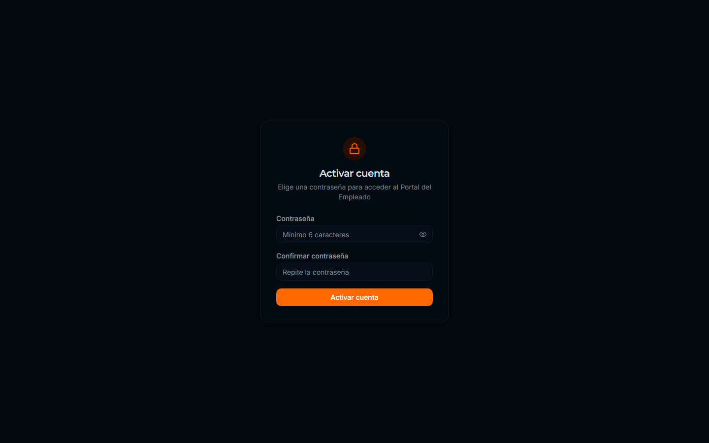

# SEGOLIFE — Manual del Empleado

> Para quién es este manual: personal interno de Segolife dado de alta en
> el módulo de RRHH de la plataforma. Documento verificado contra el código
> real de producción el 2026-08-17; documenta únicamente funcionalidad que
> existe hoy con una pantalla de uso real — no se documentan capacidades de
> RRHH sin flujo de uso disponible.

## 1. Activar tu cuenta

Cuando Segolife te da de alta como empleado, recibes un enlace de
activación con la forma **`/empleado/activar?token=...`**. En esa pantalla:

1. Eliges tu contraseña (mínimo 6 caracteres).
2. La confirmas.
3. Pulsas **Activar cuenta**.

A partir de ahí, tu acceso al Portal del Empleado es con tu email y esa
contraseña, desde **https://www.segolife.es/login**.

## 2. Portal del Empleado

Tras entrar, llegas a **`/empleado`** — tu pantalla de inicio, con accesos
directos a:

- **Fichar entrada / Trabajando ahora** — tarjeta destacada arriba: si no
  has fichado, te deja registrar tu entrada; si ya estás fichado, muestra
  desde qué hora y te permite fichar la salida.
- **Mi perfil** — tus datos personales y de contrato.
- **Mis documentos** — documentos disponibles asociados a tu perfil.
- **Mis nóminas** — histórico salarial y PDFs de nómina disponibles.
- **Vacaciones y permisos** — solicitar ausencias y consultar tu saldo.

## 3. Fichar (control horario)

Desde `/empleado/fichar`:

- Si no estás fichado, puedes registrar tu **entrada**.
- Si ya estás fichado, la misma pantalla te permite registrar tu **salida**.

## 4. Mi perfil

Desde `/empleado/perfil` consultas tus datos personales y los datos de tu
contrato con Segolife.

## 5. Mis documentos

Desde `/empleado/documentos` consultas los documentos que Segolife ha
puesto a tu disposición (contrato u otra documentación asociada a tu alta).

## 6. Mis nóminas

Desde `/empleado/nominas` consultas tu histórico salarial y descargas el
PDF de cada nómina disponible.

## 7. Vacaciones y permisos

Desde `/empleado/vacaciones`:

1. Consultas tu saldo de días disponibles.
2. Solicitas una nueva ausencia.
3. Ves el **estado de cada solicitud**: pendiente, aprobada o rechazada
   (con el motivo, si fue rechazada).

## 8. Preguntas frecuentes

**No recibí el enlace de activación / se me caducó.**
Contacta con RRHH de Segolife para que te reenvíen el alta.

**He olvidado mi contraseña.**
Contacta con RRHH de Segolife — el cambio de contraseña de empleados no es
autoservicio en este momento.

**No veo una nómina/documento que debería estar ahí.**
Contacta con RRHH de Segolife indicando el periodo o documento concreto que
falta.
